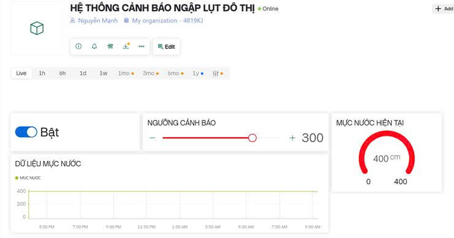
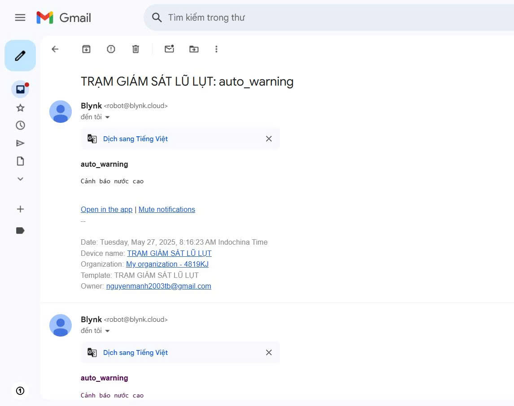

# 🌧️ HỆ THỐNG CẢNH BÁO NGẬP LỤT ĐÔ THỊ DỰA TRÊN IoT

## 📌 Giới thiệu

Hệ thống cảnh báo ngập lụt đô thị ứng dụng công nghệ IoT giúp theo dõi **mực nước tại các điểm có nguy cơ ngập** theo thời gian thực. Khi mực nước vượt qua ngưỡng cảnh báo được thiết lập, hệ thống sẽ **gửi cảnh báo trực tiếp đến người dùng** thông qua giao diện web. Đây là giải pháp hiện đại, giá rẻ và có thể triển khai linh hoạt trong các khu dân cư, đô thị, khu vực thường xuyên bị ngập lụt.

---

## 🛠️ Thiết bị phần cứng

- **KIT ESP32-WROOM-32S**: Vi điều khiển hỗ trợ WiFi
- **ESP32 IoT Shield**: Kết nối các module dễ dàng
- **Cảm biến siêu âm SR04T chống nước**: Đo khoảng cách đến mặt nước
- **Màn hình OLED 1.3 inch SH110x**: Hiển thị dữ liệu trực tiếp tại điểm đo

📷 **Hình ảnh phần cứng hệ thống:**

## 🔁 Sơ đồ hoạt động hệ thống

[ Cảm biến SR04T ]
       ↓
[ ESP32 đo mực nước ]
       ↓
[ Gửi dữ liệu qua WiFi ]
       ↓
[ Nền tảng IoT/Webserver ]
       ↓
[ Giao diện người dùng & cảnh báo ]

💡 Chức năng chính

Đo mực nước theo thời gian thực

Thiết lập ngưỡng cảnh báo linh hoạt

Hiển thị mực nước bằng đồng hồ đo và biểu đồ

Phát cảnh báo khi vượt ngưỡng

Lưu trữ lịch sử mực nước để phân tích sau

🧠 Công nghệ sử dụng

Thành phần: Công nghệ

Vi điều khiển: ESP32 WiFi

Giao tiếp: WiFi MQTT / HTTP

Hiển thị cục bộ: Màn hình OLED SH110x

Giao diện trực tuyến: Web Dashboard (Node-RED, ThingsBoard, Blynk hoặc nền tảng tùy chọn)

Lưu trữ dữ liệu: Cloud hoặc local server

🖥️ Giao diện hệ thống cảnh báo

Cho phép bật/tắt hệ thống

Cài đặt ngưỡng cảnh báo (VD: 300 cm)

Biểu đồ thời gian thực

Đồng hồ đo hiển thị mực nước hiện tại

🖥️ Kết quả báo về Gmail

